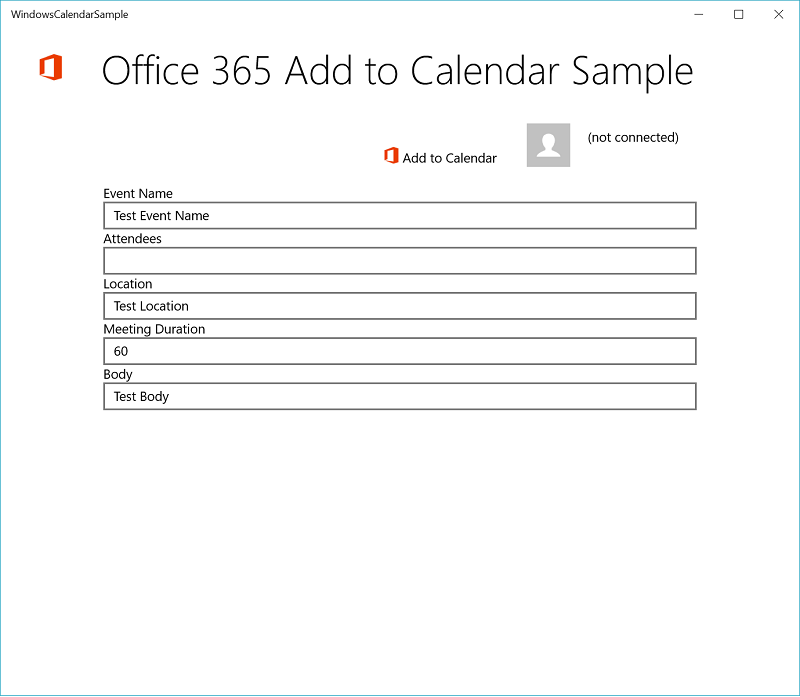
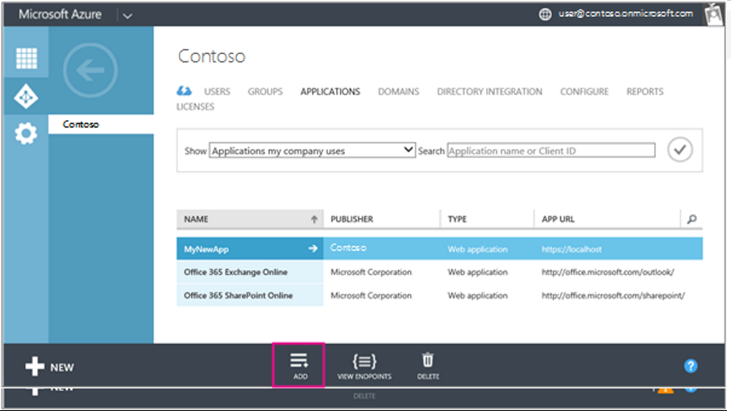
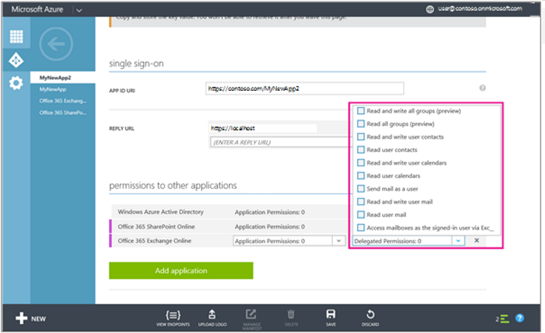
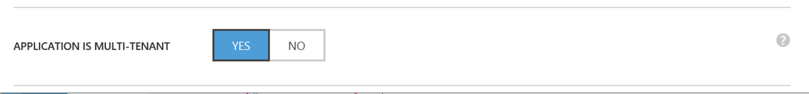
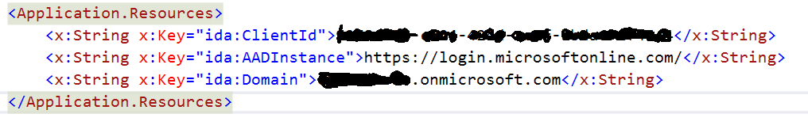

# Office 365 Add to Calendar sample using Windows UWP

Connecting to Office 365 is the first step every app must take to start working with Office 365 services and data. This sample shows how to connect and then call the O365 API's to add a calendar event.
> Note: Try out the [Get started with Office 365 APIs](http://dev.office.com/getting-started/office365apis?platform=option-angular#setup) page which simplifies registration so you can get this sample running faster.

## Prerequisites

If you set the value of _authenticationContext.UseCorporateNetwork (in AuthenticationHelper.cs) to true so that you can use this app inside a corporate intranet. If the value of UseCorporateNetwork is true, you also need to add the Enterprise Authentication, Private Networks, and Shared User Certificates capabilities in the Package.appxmanifest file.

## Register your application with Azure Active Directory
	1. Sign into the Azure Management Portal using your Office 365 Tenant Administrator credentials.
	2. Click Active Directory on the left menu, then click on the directory for your Office 365 developer site. 

	3. On the top menu, click Applications.
	4. Click Add from the bottom menu.

	5. On the What do you want to do page, click Add an application my organization is developing.
	6. On the Tell us about your application page, specify any name [Add2Calendar] for the application name and select NATIVE CLIENT APPLICATION for Type.
	7. Click the arrow icon on the bottom-right corner of the page.
	8. On the Application information page, specify a Redirect URI. For this example, you will need to specify the 'ms-appx://' redirect, which will redirect back to the right location in your application.  You will find this value by running the application and looking for the value of WebAuthenticationBroker.GetCurrentApplicationCallbackUri(); Click the checkbox in the bottom right corner of the page.
	9. Once the application has been successfully added, you will be taken to the Quick Start page for the application. From here, click Configure in the top menu.
	10. In permissions to other applications, click Add application.
	11. Click Microsoft Graph, and then click the check mark icon. 
	12. Under permissions to other applications, click the Delegated Permissions column for Microsoft Graph.  Select Have Full Access to User's Calendars. These are the permissions that will be displayed to your app user when Azure prompts them to consent to your app's permission request. In general, request only the services your app actually requires, and specify the least level of permissions in each service that still enable your app to perform its functions.

	13. Select Yes for Application is Multi-Tenant.  This will allow the application to read from any Tenant in O365 if the user gives permission.

	14. Copy the value specified for Client ID; you will need to paste this into the app.xaml file in the project.  Also make sure to update the value of the tenant to your tenant name [ie xxx.onmicrosoft.com].

	15. Click Save in the bottom menu.

## Questions and comments

We'd love to get your feedback about the Office 365 Calendar sample. You can send your questions and suggestions to us in the [Issues](https://github.com/chadbrooks/Windows0ffice365CalendarSample/issues) section of this repository.

Your feedback is important to us. Connect with us on [Stack Overflow](http://stackoverflow.com/questions/tagged/office365+or+microsoftgraph). Tag your questions with [MicrosoftGraph] and [office365].
  
## Additional resources

* [Office Dev Center](http://dev.office.com/)
* [Microsoft Graph API](http://graph.microsoft.io)
* [Office 365 Profile sample for Angular](https://github.com/OfficeDev/O365-Angular-Profile)
* [Office UI Fabric](http://dev.office.com/fabric)

## Copyright
Copyright (c) 2015 Microsoft. All rights reserved.

